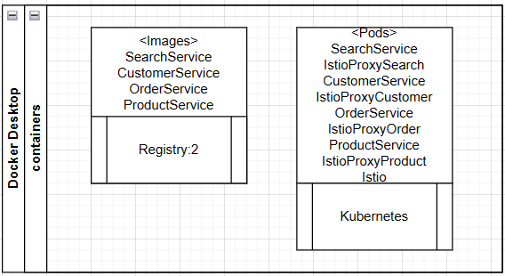

**Ecommerce Istio Run**

**(1) Flow**

> SearchService calls CustomerService, ProductService and OrderService
>
> Post HTTP: <http://localhost/api/search>
>
> Body:
>
> {
>
> \"customerId\": 1
>
> }

 

**(2) To create docker image**

  > \> docker build -t orderservice .

  > \> docker build -t customerservice .

  > \> docker build -t productservice .

  > \> docker build -t searchservice .

 

**(3) List all docker images**

 > \> docker images

 

**(4) Images in DockerHub or Registry:2**
Manifest files pull images for either Docker Hub or from "Registry:2"

 

**(5) Option with Docker Hub**
Tag docker for pushing to docker hub (should match userid in hub)

> docker tag productservice {userid}/productservice  
  docker tag orderservice {userid}/orderservice  
  ocker tag searchservice {userid}/searchservice  
  docker tag cusrtomerservice {userid}/customerservice  

> docker push {userid}/productservice  
  docker push {userid}/orderservice  
  docker push {userid}/searchservice  
  docker push {userid}/customerservice  

 

**(6) Option with storing image in local Registry:2**
specs https://docs.docker.com/registry/spec/api/
Images stored inside of var/lib/docker/registry folder

create a registry
> docker run -d -p 5000:5000 --restart=always --name registry registry:2

tag and push images to registry
> docker tag productservice localhost:5000/productservice  
  docker push localhost:5000/productservice

> docker tag customerservice localhost:5000/customerservice  
  docker push localhost:5000/customerservice

> docker tag orderservice localhost:5000/orderservice  
  docker push localhost:5000/orderservice

> docker tag searchservice localhost:5000/searchservice  
  docker push localhost:5000/searchservice

 

**(7) Download Istio and install with a demo option**
> istioctl install --set profile=demo

 

**(8) Label namespace for automatic sidercar injection**
> kubectl label namespace default istio-injection=enabled

 

**(9) Deploy to kubernetes**

> kubectl apply -f customerservice-deploy.yml  
  kubectl apply -f productservice-deploy.yml  
  kubectl apply -f orderservice-deploy.yml  
  kubectl apply -f searchservice-deploy.yml  

 

**(10) Enable ingressgateway for search service**
> kubectl apply -f searchservice-gateway.yml  
  -check for IP  
  kubectl get svc istio-ingressgateway -n istio-system

There are two types of gateways (for ingress). Istio API Gateway and Kibernetes Gateway. Istio will default to kubernetes gateway going forward.

   

**(8) Kubectl commands**

To get pod details
> kubectl get pod -o wide

Scale to 0
> kubectl scale --replicas=0 deployment/customerservice

Delete deployments and service endpoints

> kubectl get deployments  
  kubectl delete deployment {deployment name}  
  kubectl get services -o wide  
  kubectl delete service {servicename}  
