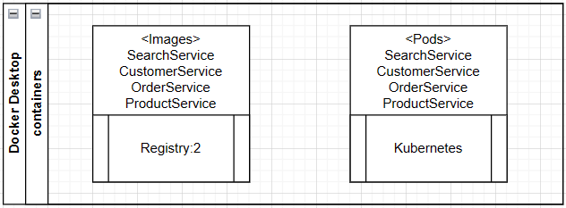

**Ecommerce Docker Run**

**(1) Flow**

> SearchService calls CustomerService, ProductService and OrderService
>
> Post HTTP: <http://localhost:3003/api/search>
>
> Body:
>
> {
>
> \"customerId\": 1
>
> }

 

**(2) To create docker image**

  > \> docker build -t orderservice .

  > \> docker build -t customerservice .

  > \> docker build -t productservice .

  > \> docker build -t searchservice .

 

**(3) List all docker images**

 > \> docker images

 

